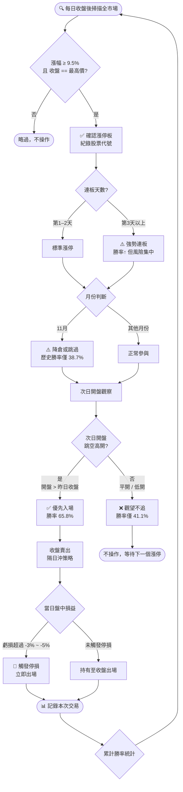

台股漲停次日策略回測
# 台股漲停次日策略回測報告

> **回測期間**：2024/01/01 – 2026/05/09
> 
> 
> **樣本宇宙**：95 支跨產業 TWSE 普通股（均勻抽樣）
> 
> **漲停事件數**：718 次
> 
> **資料來源**：FinMind API（TaiwanStockPrice）
> 

---

## 策略流程圖

> **流程說明**
> 
> 
> - 漲停判斷採雙重確認：漲幅門檻（9.5%）＋收盤等於最高價
> 
> - 跳空高開是核心過濾器：勝率從 57.7% → 65.8%
> 
> - 11月為全年最弱月，建議降倉或跳過
> 
> - 連板第3天以上勝率高達 75%，但樣本少、個股集中風險大
> 
> - 停損設在 -3% 至 -5%（對應回測 10–25 分位風險）
> 

---

## 策略定義

**進場條件（漲停判斷）**：
1. 當日漲幅 ≥ 9.5%（台股漲停約 10%，考量 tick 四捨五入）
2. 當日收盤價 == 當日最高價（真正打到漲停板，非只是漲幅達標）

**持有方式**：漲停日收盤買進 → 次日收盤賣出（隔日沖）

---

## 核心回測結果

### 次日勝率總覽

| 指標 | 數值 |
| --- | --- |
| 漲停次日上漲勝率 | **57.7%**（414/718） |
| 漲停次日持平 | 2.6%（19/718） |
| 漲停次日下跌 | 39.7%（285/718） |
| 次日平均漲幅 | **+1.15%** |
| 次日中位數漲幅 | +1.21% |
| 次日漲幅標準差 | 11.44% |

### 對照基準

| 情境 | 次日上漲機率 |
| --- | --- |
| 普通日（隨機基準） | 42.8% |
| **漲停次日（整體）** | **57.7%** |
| **超額勝率** | **+14.9 個百分點** |

---

## 情境細分分析

### 1. 跳空情境

| 次日開盤狀況 | 勝率 | 樣本數 |
| --- | --- | --- |
| 跳空高開（次日開盤 > 漲停收盤） | **65.8%** | 482 次 |
| 平開 / 低開 | 41.1% | 236 次 |

> **結論**：跳空高開才是真正有優勢的進場時機；平開或低開的勝率甚至低於隨機基準。
> 

### 2. 月份效應

| 月份 | 勝率 |
| --- | --- |
| 3 月 | 68.4%（最強） |
| 4 月 | 63.0% |
| 7 月 | 63.3% |
| 11 月 | **38.7%**（最弱） |
| 6 月 | 50.0% |

> **結論**：Q1–Q2 與 7 月動能較強；11 月為全年最弱，疑為年底法說出貨季節。
> 

### 3. 連續漲停效應（連板）

| 連漲停天數 | 次日勝率 | 樣本數 |
| --- | --- | --- |
| 第 1 天 | 56.5% | 570 |
| 第 2 天 | 56.6% | 106 |
| 第 3 天 | **75.0%** | 24 |
| 第 4 天 | **70.0%** | 10 |
| 第 5 天 | 100.0% | 5（樣本過少，參考用） |

> **結論**：三板以上連漲停具備「強趨勢」特性，勝率顯著提升，但樣本數少，個股風險集中。
> 

### 4. 次日再漲停機率

漲停後次日再次漲停的比例：**20.8%**（1/5 機率）

---

## 次日漲幅分位數

| 分位數 | 次日漲幅 |
| --- | --- |
| 5% | -7.16%（尾端風險） |
| 10% | -4.82% |
| 25% | -2.12% |
| 50%（中位數） | +1.21% |
| 75% | +7.26% |
| 90% | +9.93%（幾乎再漲停） |
| 95% | +9.97% |

---

## 為何漲停後次日傾向上漲？（機制解釋）

### 1. 動能效應（Momentum）

漲停代表買方完全控盤、收盤無賣壓。市場動能具有短期延續性，漲停形成的強烈多頭訊號往往延伸到次日開盤。

### 2. 籌碼鎖定效應

漲停板上的買單無法全數成交，大量掛單「鎖死」——未能買到的投資人次日會繼續追買，供需失衡推升股價。

### 3. 媒體曝光 / 散戶追漲

漲停個股隔日登上各大股市看板、社群媒體，吸引散戶追買，形成額外的買單動能。

### 4. 主力未完成出貨

驅動漲停的主力資金若尚未達到目標持倉或出貨量，次日會繼續護盤，避免出現明顯跌勢影響籌碼佈局。

### 5. 連板雪球效應

進入連板模式後，空頭被迫回補、停損觸發買單、追板程式單同步湧入，形成自我強化的正向循環，這解釋了第3天以上連板勝率跳升至 75% 的現象。

---

## 風險與限制

| 風險點 | 說明 |
| --- | --- |
| **高波動** | 標準差 11.44%，下行尾端風險 -7% 以上 |
| **平/低開陷阱** | 平開或低開後勝率僅 41.1%，比隨機還差 |
| **11 月季節效應** | 全年最弱月，勝率僅 38.7% |
| **流動性風險** | 漲停後次日可能出現開盤即砸盤的情形（跌停開） |
| **樣本偏差** | 本回測僅含 95 支股票，中小型個股代表性不足 |
| **交易成本未計入** | 實際執行需扣除手續費（0.1425%）與證交稅（0.3%） |

---

## 操作建議

| 條件 | 動作 |
| --- | --- |
| 漲停 + 次日跳空高開 | ✅ 追買，勝率 65.8% |
| 漲停 + 次日平開 / 低開 | ❌ 觀望，勝率不如基準 |
| 連板第 3 天以上 | ⚠️ 高勝率但個股集中風險大，輕倉參與 |
| 11 月漲停股 | ⚠️ 降低倉位或跳過 |
| 停損設定 | 建議 **-3% 至 -5%**（對應 10–25 分位風險） |

---

## 回測侷限聲明

本回測為統計分析，不構成投資建議。實際操作須考量：
- 流動性（成交量不足無法執行）
- 交易成本（手續費 + 證交稅 ≈ 0.585%）
- 市場環境（牛熊市下動能效應強弱不同）
- 個股基本面（配合財務惡化的漲停需特別謹慎）

---

---

## 附錄：回測樣本股票清單（95 支）

> 每個產業最多抽 5 支，以 `random_state=42` 均勻抽樣，確保跨產業代表性。
> 
> 
> 下載成功 95 支（原抽 100 支，5 支無資料略過）。
> 

| 產業 | 股票代號與名稱 |
| --- | --- |
| **光電業** | 3669 圓展、3543 州巧、2406 國碩、5234 達興材料 |
| **其他** | 2443 昶虹、6671 三能-KY、9933 中鼎、2496 卓越、8499 鼎炫-KY |
| **其他電子業** | 2373 震旦行、3518 柏騰、2482 連宇、3030 德律、6658 聯策 |
| **化學工業** | 1711 永光、4720 德淵、3708 上緯投控、4770 上品、1714 和桐 |
| **化學生技醫療** | 6645 金萬林-創、1736 喬山、1725 元禎、4108 懷特 |
| **半導體業** | 6243 迅杰、6756 威鋒電子、8271 宇瞻、7768 頌勝科技 |
| **塑膠工業** | 1323 永裕、1310 台苯、1309 台達化、1325 恆大 |
| **建材營造** | 2527 宏璟、1316 上曜、2520 冠德、2535 達欣工、9946 三發地產 |
| **數位雲端** | 8487 愛爾達-創、6906 現觀科、7823 奧義賽博-KY創、7722 LINEPAY、7765 中華資安 |
| **橡膠工業** | 2114 鑫永銓、2105 正新、6582 申豐、2109 華豐、2102 泰豐 |
| **水泥工業** | 1108 幸福、1103 嘉泥、1102 亞泥、1101 台泥、1109 信大 |
| **汽車工業** | 3717 聯嘉投控、2228 劍麟、2231 為升、1339 昭輝、1319 東陽 |
| **油電燃氣業** | 9937 全國、2616 山隆、6505 台塑化、9918 欣天然、8926 台汽電 |
| **玻璃陶瓷** | 1806 冠軍、1817 凱撒衛、1809 中釉、1802 台玻、1810 和成 |
| **生技醫療業** | 6919 康霈*、4148 全宇生技-KY、3705 永信、1598 岱宇、6472 保瑞 |
| **紡織纖維** | 1423 利華、4441 振大環球、1441 大東、1402 遠東新、1440 南紡 |
| **綠能環保** | 7610 聯友金屬-創、6873 泓德能源、5292 華懋、6923 中台、6969 成信實業*-創 |
| **航運業** | 2611 志信、2642 宅配通、2617 台航、2645 長榮航太 |
| **觀光事業** | 9943 好樂迪、2705 六福、2712 遠雄來、2704 國賓、2722 夏都 |
| **觀光餐旅** | 7705 三商餐飲、7760 享溫馨 |
| **貿易百貨** | 2911 麗嬰房、8429 金麗-KY、2614 東森 |

### 樣本覆蓋說明

- **未涵蓋產業**：金融保險、電機機械、鋼鐵工業、食品工業、電子零組件業等因抽樣上限未納入
- **半導體業僅 4 支**：台積電（2330）、聯發科（2454）等大型權值股不在樣本中，半導體族群代表性偏低
- **改善方向**：若需針對特定產業做精準回測，建議另外跑該產業專屬樣本

---

*生成時間：2026-05-12 ｜ 工具：FinMind API + Python (pandas / matplotlib)*
